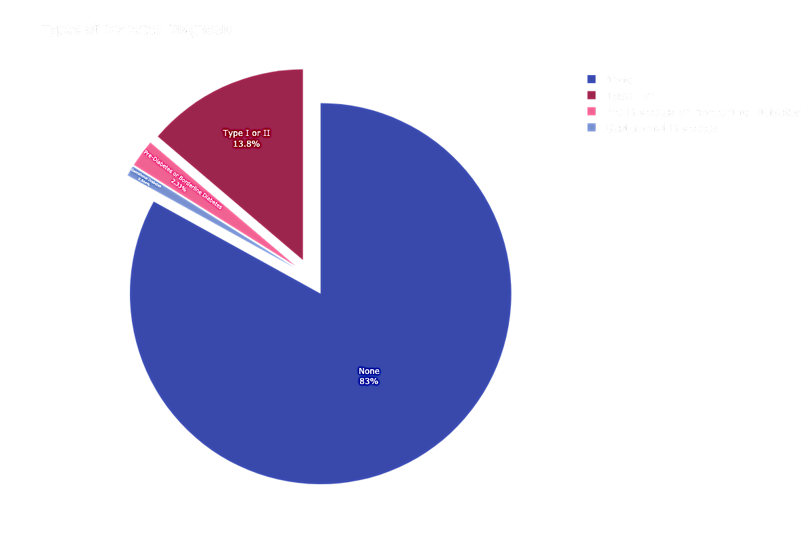

# Behavioral and Genetic Factors Predictive of Diabetes

# Overview

This project aims to determine high-risk factors of diabetes, and use them to build a model that can help insurance companies, and users, identify people at high-risk for the disease.

# Data Understanding

Due to the size of the dataset, I can not directly push it to my online repository. The **dataset can be accessed here**:

- [2022 BRFSS Survey Data and Documentation](https://www.cdc.gov/brfss/annual_data/annual_2022.html)

# Data Preparation

This dataset has so many columns. It will be most efficient to **harness domain knowledge** for initial feature selection, rather than going through the entirety of the codebook. Then I can hone and tweak as needed.

Below are some *Risk Factors of Diabetes* that exist as features in this dataset, pulled from various credible sources such as the American Heart Association, National Institutes of Health, Maya Clinic, Centers for Disease Control and Prevention, etc.

## Diabetes Risk Factors

#### High Risk

High risk factors directly linked to the development of Type 2 Diabetes:

- **Weight**: Being overweight or obese
- **Exercise/Activity**: Being less physically active active (less than 3 times a week)
- **Family History**: Having a parent or sibling with diabetes
- **Race and Ethnicity**: People of certain races and ethnicites - *including Black, Hispanic, Native American and Asian people, and Pacific Islanders* - are more likely to develop diabetes than white people.
- **Age**: Risk increases with age, especially after ages 35-45
- **Prediabetes**: Diagnosed with prediabetes
- **Pregnancy**: Having gestational diabetes during pregnancy puts people at greater risk from developing type 2 diabetes
- **NAFLD**: Diagnosed with Non-Alcoholic Fatty Liver Disease
- **High Blood Pressure/Hypertension**
- **Smoking**

#### Other Possible Risk Factors

Additional risk factors that might help indirectly induce diabetes, when paired with some of the high-risk factors above.

- **Stress**: Stress hormones might cause blood sugar levels to rise, and stop insulin-producing cells in the pancreas from working properly
- **Lack of Sleep**: Insufficient sleep can cause stress hormones which disrupt the body's ability to release insulin after you eat
- **Food Quality**: Frequently eating highly processed, high-carbohydrate foods and saturated fats
- **Excess Alcohol**: Excessive alcohol consumption
- **Lower Income**
- **Gum Disease**: Inflammation from gum disease can lead to higher blood glucose levels
- **Pancreatic Cancer**: Diabetes might be a symptom of pancreatic cancer

Type 1 VS. Type 2 -- **In the United States**, white people more likely to develop type 1 usually in children, teens, or young adults

# Modeling

The scikit-learn package was primarily used to run Multinomial Naive Bayes, Multinomial Logistic Regression, and Random Forest. Hyperparameter tuning was needed to improve model performances. 

I also had to account for class imbalance using techniques such as SMOTE and adjusting class weights, and rely on PR Curve rather than ROC for additional model-performance visuals. 

# Evaluation

Random Forest was the most successful model. My main metric was ***Recall***, weighted to account for class imbalance.
